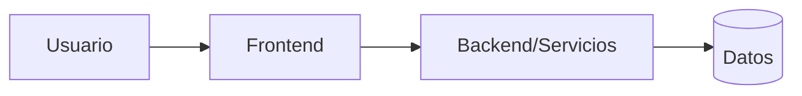

# Project Blueprint — [Nombre]

**Estado:** Draft | Review | Approved  
**Versión:** 0.1  
**Fecha:** YYYY-MM-DD  
**Responsable:** [Nombre/rol]

## 1. Resumen ejecutivo
- Problema:
- Resultado esperado:
- Tipo de proyecto:
- Nivel de complejidad:
- Estado de preparación:

## 2. Fuentes y autoridad
| Prioridad | Fuente | Estado | Uso |
|---|---|---|---|

## 3. Usuarios y roles
| Usuario/rol | Objetivo | Acciones | Restricciones |
|---|---|---|---|

## 4. Flujos principales
1. [Flujo]
   - Inicio:
   - Pasos:
   - Resultado:
   - Excepciones:

## 5. Alcance
### MVP
### Fuera de alcance
### Futuro posible

## 6. Requisitos
### Funcionales
### No funcionales
### Criterios de aceptación

## 7. Stack recomendado
| Área | Necesidad | Elección | Motivo | Alternativa | Disparador de cambio |
|---|---|---|---|---|---|

## 8. Arquitectura

## 9. Datos, archivos e integraciones
### Entidades
### Datos sensibles
### Archivos
### Integraciones

## 10. Contenido y CMS
- Necesidad editorial:
- Modelo de contenido:
- Roles y workflow:
- Preview/publicación:

## 11. UX y sistema de diseño
- Dispositivos prioritarios:
- Accesibilidad:
- Estrategia de componentes:
- Motion:

## 12. Seguridad y operación
- Amenazas principales:
- Autenticación/autorización:
- Secretos:
- Backups/recuperación:
- Observabilidad:
- Incidentes:

## 13. Calidad
- Tests:
- Rendimiento:
- SEO/GEO/AEO:
- Definition of Done:

## 14. Entrega
### Fases
### Dependencias
### Riesgos

## 15. Decisiones, supuestos y pendientes
| ID | Tipo | Descripción | Responsable | Fecha límite |
|---|---|---|---|---|

## 16. Architecture Readiness Check
| Criterio | Estado | Evidencia/pendiente |
|---|---|---|

**Resultado:** READY | READY WITH RISKS | NOT READY
