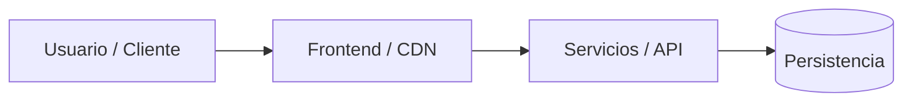

# Project Blueprint — [Nombre del Proyecto]

**Modo:** Greenfield | Retrofit | Decision Patch  
**Estado:** Draft | Review | Approved  
**Versión:** 0.1  
**Fecha:** YYYY-MM-DD  
**Responsable:** [Nombre/rol]

---

## 1. Resumen ejecutivo
- **Problema:** [Descripción concreta del problema de negocio o usuario]
- **Resultado esperado:** [Métrica observable o criterio de éxito]
- **Tipo de proyecto:** [Categoría: Landing, SaaS, Intranet, E-commerce, etc.]
- **Nivel de complejidad:** L0 (Estático) | L1 (Contenido) | L2 (App simple) | L3 (App crítica) | L4 (Plataforma escalable)
- **Estado de preparación (Readiness):** READY | READY WITH RISKS | NOT READY

---

## 2. Fuentes y autoridad
| Prioridad | Fuente / Documento | Estado | Tipo de evidencia |
|---|---|---|---|
| 1 | Conversación con usuario | Confirmado | Instrucción directa |
| 2 | Repositorio existente / código | Evidencia | Contexto actual (requiere validación) |
| 3 | Documentación técnica previa | Supuesto | Sujeto a revisión de arquitectura |

---

## 3. Usuarios y roles
*(Si no hay autenticación ni usuarios diferenciados, registrar como N/A con justificación).*

| Usuario / Rol | Objetivo principal | Acciones permitidas | Restricciones / Permisos |
|---|---|---|---|
| [Rol 1] | | | |

---

## 4. Flujos principales
1. **[Flujo principal 1]**
   - **Inicio:** [Disparador o evento inicial]
   - **Pasos clave:** [Secuencia de acciones]
   - **Resultado:** [Estado final o artefacto producido]
   - **Excepciones / Errores:** [Tratamiento de fallos críticos]

---

## 5. Alcance
- **MVP (Fase actual):** [Lo que se resuelve y construye en esta etapa]
- **Fuera de alcance explícito:** [Lo que NO se construye deliberadamente]
- **Futuro / Evolución:** [Capacidades diferidas]

---

## 6. Requisitos y criterios de aceptación
- **Funcionales:**
  - [REQ-F1]
- **No funcionales (rendimiento, seguridad, disponibilidad):**
  - [REQ-NF1]
- **Criterios de aceptación:**
  - [ ] [Criterio verificable 1]

---

## 7. Matriz de decisiones de arquitectura
*(En modo Retrofit, incluir columna `Actual → Objetivo` cuando difieran).*

| Área | Necesidad | Elección | Motivo | Alternativa evaluada | Disparador de cambio |
|---|---|---|---|---|---|
| Framework / Render | | | | | |
| Persistencia / DB | | | | | |
| Autenticación | | | | | |
| CMS / Editorial | | | | | |
| Almacenamiento | | | | | |
| Integraciones | | | | | |
| Verificación / Test | | | | | |
| Seguridad / Ops | | | | | |

---

## 8. Arquitectura y componentes

```mermaid
flowchart LR
  U[Usuario / Cliente] --> F[Frontend / CDN]
  F --> B[Servicios / API]
  B --> D[(Persistencia)]
```
*(Para proyectos L0/L1 o estáticos, simplificar o describir componentes en texto).*

---

## 9. Datos, archivos e integraciones
*(Si no aplica, indicar N/A y justificar).*
- **Entidades de datos:** [Esquema preliminar o N/A]
- **Datos sensibles / Privacidad:** [Identificación de datos protegidos o N/A]
- **Archivos y almacenamiento:** [Público en CDN, buckets privados con URLs firmadas o N/A]
- **Integraciones externas:** [APIs de terceros, pasarelas, webhooks o N/A]

---

## 10. Contenido y gestión editorial
*(Si no aplica, indicar N/A y justificar).*
- **Necesidad editorial:** [¿Quién edita y con qué frecuencia?]
- **Modelo de contenido:** [En repositorio (Markdown/MDX), headless CMS, o N/A]
- **Flujo de publicación:** [Preview, borradores, versionado o N/A]

---

## 11. Experiencia, sistema visual e identidad
- **Dispositivos prioritarios:** [Desktop, Mobile first, Tablet, etc.]
- **Accesibilidad (a11y):** [Criterios esenciales]
- **Estrategia de componentes:** [Primitives, componentes por feature, design tokens]
- **Páginas de sistema (404, error, sin permiso):** Responsable de copy y 2-3 destinos útiles de rescate.
- **Identidad visible:** Responsable de piezas (`/favicon.ico`, `/icon.svg`, `/icon-192.png`, `/icon-512.png`, `/apple-touch-icon.png`, `/og.png` 1200×630) y regla de versionado por cambio de nombre (`og-v2.png`).

---

## 12. Seguridad y operación
- **Modelo de amenazas:** [Riesgos principales a mitigar]
- **Gestión de secretos:** [Variables de entorno seguras, rotación o N/A]
- **Respaldos y recuperación:** [RPO / RTO objetivo o N/A]
- **Observabilidad:** [Logs, métricas, alertas mínimas suficientes]

---

## 13. Verificación y calidad
- **Verificaciones obligatorias de pipeline:** [Lint, typecheck, tests unitarios/integración, build según el stack real]
- **Definition of Done:** [Condiciones para considerar terminado un cambio]

---

## 14. Plan de entrega y migraciones
- **Fases de entrega:** [Hitos secuenciales]
- **En Modo Retrofit:** Resumen de brechas y referencia a `docs/migration-plan.md`.

---

## 15. Decisiones, supuestos y pendientes
| ID | Tipo | Estado | Descripción | Responsable | Condición de cierre |
|---|---|---|---|---|---|
| DEC-01 | Decisión | Confirmado | | | |
| SUP-01 | Supuesto | Supuesto | | | |
| PEN-01 | Pendiente | Pendiente de validar | | | |

---

## 16. Architecture Readiness Check
*(Los criterios que no correspondan al tipo de proyecto se marcan como N/A).*

| Criterio de Madurez | Estado (CUMPLE / PENDIENTE / N/A) | Justificación / Evidencia |
|---|---|---|
| Problema y resultado esperado delimitados | | |
| Usuarios, roles y restricciones resueltos | | |
| Alcance y límites del MVP explícitos | | |
| Decisiones de arquitectura y stack justificadas | | |
| Modelo de datos y persistencia coherente | | |
| Seguridad y riesgos evaluados | | |
| Estrategia de testing adecuada al stack y riesgo | | |
| Operación, despliegue y continuidad claros | | |
| Supuestos y decisiones pendientes gobernados | | |
| Bloqueadores arquitectónicos ausentes | | |

**Resultado final:** READY | READY WITH RISKS | NOT READY
